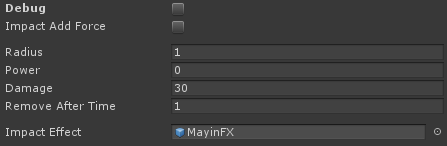
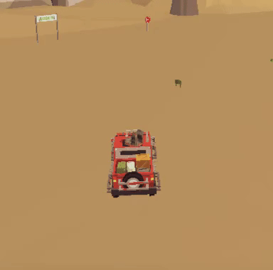

# Unity Mine Explosion C# Script With Explosion Effect
-------------

### Usage

Add to mine gameobject this script (no required collider)

- debug (bool) : Show/hide radius
- ImpactAddForce (bool) : Add Force with rigidboy

- radius (float) : Determination radius
- power (float) : Addforce rigidbody
- damage (float) : Send damage value collider gameobject
- removeAfterTime (float) : Destroy mine gameobject

- ImpactEffect (gameobject) : Create impact effect
- colliders (collider) : Collider

#Preview

